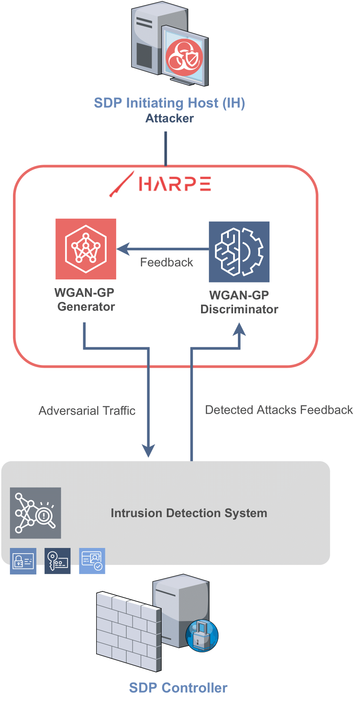
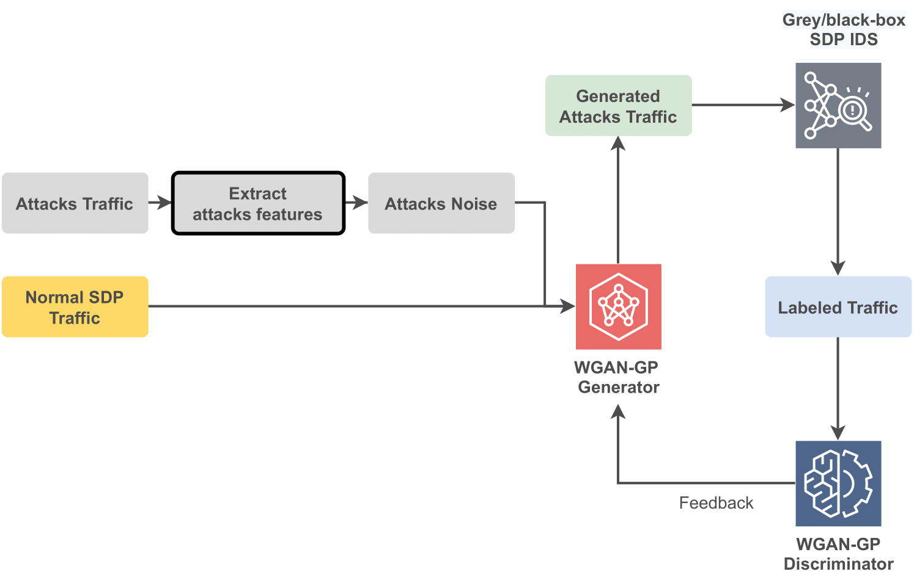

# Harpe: Using Adversarial Machine Learning to dodge Intrusion Detection Systems in Software-Defined Perimeters

## Abstract

With the increasing reliance on Software-Defined Perimeters (SDPs) for network security, it is
important to understand the limitations and vulnerabilities of this architecture. This paper proposes
a framework, Harpe, that generates attacks on SDP-based networks to demonstrate the potential
weaknesses of this architecture. Harpe generates malicious network traffic that mimics normal
traffic to evade the Intrusion Detection System (IDS) component of SDPs. Utilizing Adversarial
Machine Learning techniques, it learns how the IDS operates and finds ways to evade detection. The
effectiveness of the proposed framework is tested in two different environments, a traditional network
architecture and an SDP-based network. The results show that Harpe is capable of significantly
reducing the detection capabilities of the IDS in both environments, highlighting the need for further
research and improvement of SDP security mechanisms.

## Harpe

